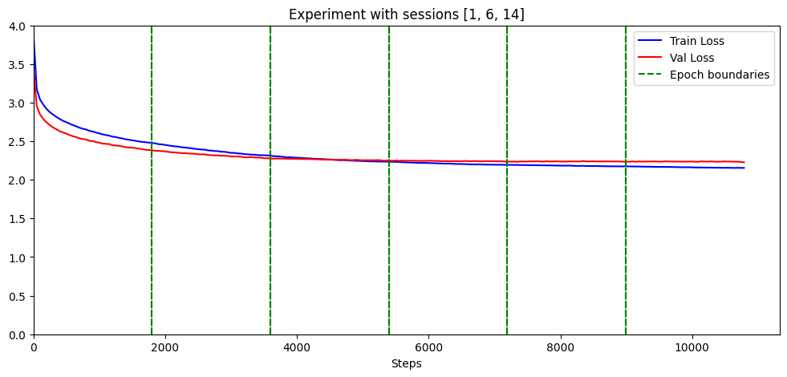

This is the repository for a project on finetuning a 124M parameter GPT-2 model on Edward Witten's papers available on arXiv. The main goal of this project is to implement what we have learned about training large language models. Another goal was to explore whether a language model could learn the distinctive writing style and technical vocabulary in theoretical physics research papers.

## EXPERIMENTS

We ran various experiments with different choices of learning rates and learning rate schedules. The goal of performing different experiments is to find the learning rate configuration with the best performance. We measure the performance by comparing the validation loss and the 'gap' defined as the absolute difference between the training and the validation loss. 

We found that the following two configurations led to the best performance: 
1. Training the first two epochs with a constant learning rate $5\times 10^{-5}$ and the third and fourth epochs with a constant learning rate of $3\times 10^{-5}$.
2. Training the first two epochs with a constant learning rate $5\times 10^{-5}$ and the third and fourth epochs with a linearly decreasing rate from $3\times 10^{-5}$ to $1\times 10^{-5}$. 

All the experiments were implemented in the notebook Witten_GPT_experiments.ipynb. All the experiments were performed using the T4 GPU provided with the free version of Google Colab.  

## RESULTS

In all of our experiments, the validation loss after the fourth epoch was around 2.22-2.24, but the gap between the training and validation losses depended on the learning rate configurations. Moreover, in all of our experiments, we found that training for more than four epochs did not lead to a change in the validation loss, though the training loss kept decreasing. We took this as a sign of overfitting and concluded that stopping after the four epochs is the most optimal choice. A plot for the training and validation losses for one of the experiments are below. The analysis of the validation loss and the gap was performed in the notebook Witten_GPT_loss_analysis.ipynb. 

Even though the generated text after four epochs was not factually correct and only somewhat coherent, we observed a clear improvement in LaTeX formatting and scientific writing style. In particular, we found the following changes in the model's performance after every epoch.

- After the first epoch, the model started using technical terms (e.g. manifold, super Yang-Mills theory, etc.) and started using correct LaTeX formatting for math symbols (i.e. using $ symbols). The model also learned to make references to equations (i.e. (\ref{...})) and assign labels to sections and equations (i.e. \label{...}). 

- After the second epoch, the model learned to make \subsection headings and to include citations using \cite{...}.

- After the third epoch, the model started generating equal-sized paragraphs. More interestingly, the model learned to present logical steps. For example, "To define a hyper-Kahler metric on $M$, we first define ...". 

- After the fourth epoch, the model learned to present proposals. (For e.g. "We propose that the black hole solutions should be interpreted in terms of the Kramers doubling of the entropy.") The model also started making logical arguments (e.g. "Since $G$ is the pullback of the Lie algebra generated by $M$, we can define $\Sigma$ and $\Sigma_\ell$
to be $G_\ell$-valued gauge fields on $\Sigma$ and $M$, respectively.")

As an example, here is the text generated by the model. The first line in this text was the input prompt, and the text from the second line was generated by the model.  

>We re-examine the black hole solutions in classical theories of dilaton gravity in two dimensions.  
The first is the classical solution of the Einstein-Hilbert equations with a single
singularity at the classical level, and one at the quantum level.   The second is the classical solution of the Einstein-Hilbert equations with two singularities at the classical level,
and one at the quantum level.   In the classical formulation, the two singularities must be equal (a statement that will be clear from section \ref{app:trivial}) and have a simple interpretation.  
>
>In the classical formulation, the singularities must behave like the ones we are considering in terms of the behavior of the classical action, but with
a more subtle twist.   In the classical solution, the singularities have been described explicitly in terms of the action of the fermion field, but it turns out that in the quantum
theory,  the singularities are related to the singularities that are associated to the classical action.    In the classical solution, 
the singularities have been identified with the massive Dirac operator, and the singularities associated to the classical action 
are known as supersymmetric singularities.   This is the most common characterization of a supersymmetric singular

The text was generated using a temperature of 0.7.  Further examples of the text generated by the model (using different temperatures) can be found in the notebook Witten_GPT_text_generation.ipynb.

## DATA 

The text files containing train and validation losses for every session are presented in the folder loss_histories. The trained model weights after every epoch are available at HuggingFace [https://huggingface.co/mudassirmoosa/Witten_GPT_weights](https://huggingface.co/mudassirmoosa/Witten_GPT_weights). 

## DATA COLLECTION AND PROCESSING

The model was trained on the LaTeX versions of the research papers of Edward Witten available on arXiv. Out of 233 Witten's papers available on arXiv, only 103 had LaTeX versions available. We have split these 103 papers into a train dataset containing 71 papers, a validation dataset containing 9 papers, and a test dataset containing 23 papers. In order to account for the change in Witten's writing style and research interests over the years, we have ensured that the train, validation, and test datasets must have at least one paper from every time period. 

The train dataset had almost 2 million words (or almost 5.5 million tokens).

The code to parse arXiv to get the LaTeX versions of Witten's papers, to convert them into a single text file, and then to split these papers into datasets while maintaining temporal diversity was written by Claude AI, with prompts and instructions provided by us. This code, along with the datasets, is provided in the folder Witten_latex_datasets.

